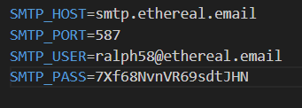
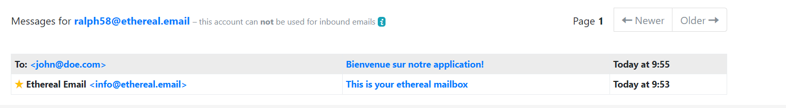
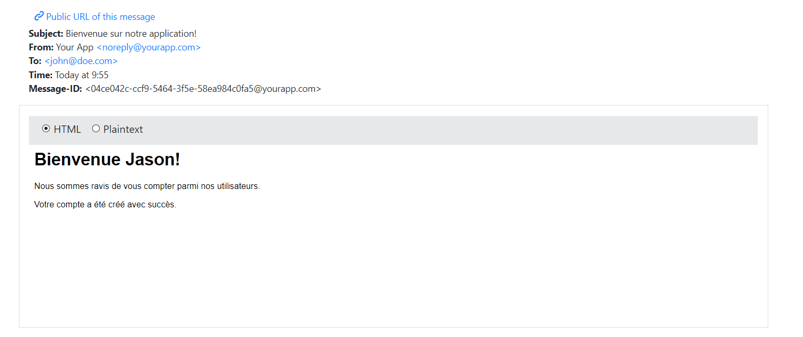

# iut-project

Sur swagger une fois authentifié pour l'authorization du token mettre : 

Bearer <token> (sans "")

Pour tester les mails : 
Créer un compte Ethereal

Allez sur https://ethereal.email/
Cliquez sur "Create Ethereal Account"
Un compte de test sera créé automatiquement avec :
Une adresse email
Un mot de passe
Les informations de configuration SMTP

Configurer le fichier .env Après avoir obtenu les informations, mettez-les dans votre fichier :

Tester l'envoi
Créez un nouvel utilisateur via l' API (route POST /user)
Retournez sur https://ethereal.email/
Connectez-vous avec vos identifiants
Cliquez sur "Messages"
l'email de bienvenue qui a été "envoyé" à votre nouvel utilisateur

