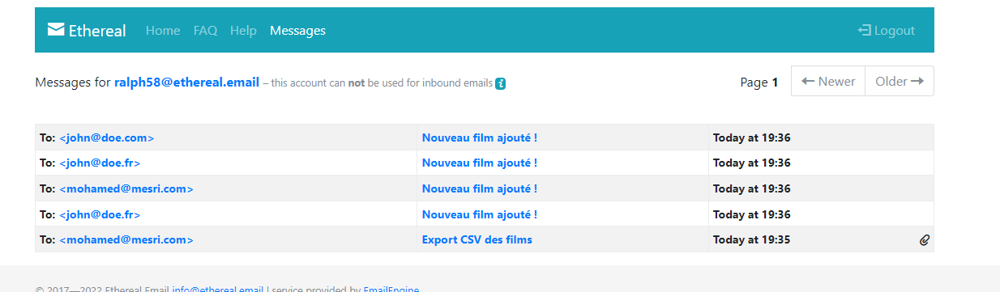
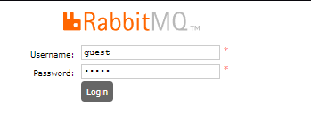
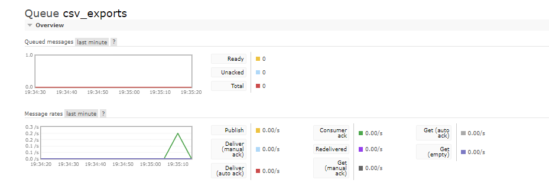

# Application de Gestion de Films

Une API REST développée avec **Hapi.js** permettant la gestion de films, d'utilisateurs et de favoris, avec des fonctionnalités de notifications par email et d'export CSV.

---

## Fonctionnalités
- **Authentification utilisateur** avec JWT
- **Gestion des films** (CRUD complet)
- **Gestion des favoris**
- **Notifications par email** :
  - Email de bienvenue lors de l'inscription
  - Notification lors de l'ajout d'un nouveau film
  - Notification lors de la modification d'un film en favori
- **Export CSV des films** (admin uniquement)

---

## Prérequis
- **Node.js** (v12 ou supérieur)
- **MySQL**
- **RabbitMQ**
- **Serveur SMTP** (pour les emails)

---

## Installation
1. **Cloner le repository**
2. **Installer les dépendances** :
   ```
   npm install 
   ``` 
    
## Configuration
Créer un fichier .env dans le dossier server avec les variables suivantes :

*Configuration Base de données*
```
DB_HOST=0.0.0.0
DB_USER=root
DB_PASSWORD=votre_mot_de_passe
DB_DATABASE=nom_de_votre_base
DB_PORT=3306
```
Alternative via Docker :

```docker run -d --name hapi-mysql -e MYSQL_ROOT_PASSWORD=hapi -e MYSQL_DATABASE=user mysql:8.0 --default-authentication-plugin=mysql_native_password -p <port nom utilisé>:3306 
```

*Configuration SMTP*
```
SMTP_HOST=votre_serveur_smtp
SMTP_PORT=587
SMTP_USER=votre_utilisateur_smtp
SMTP_PASS=votre_mot_de_passe_smtp
```

*Configuration RabbitMQ*
``` RABBITMQ_URL=amqp://localhost 
```


## Base de données
Créer une base de données MySQL
**Exécuter les migrations**:

npx knex migrate:latest

**Démarrage de l'application**
npm start

**Tests**
Exécuter la suite de tests :
npm test


## Documentation API
La documentation Swagger est accessible à : http://localhost:3000/documentation


## Authentification
La plupart des endpoints nécessitent une authentification JWT. Après connexion, incluez le token dans le header Authorization :

Bearer (espace après Bearer important ! ) <votre_token> (uniquement le valeur du token pas besoin des "")

## Rôles utilisateurs
L'application supporte deux rôles :

*user* : Accès basique aux films et favoris
*admin* : Accès complet incluant la gestion des films et l'export CSV

## Configuration des emails
Pour le développement, utilisez Ethereal Email :

Visitez https://ethereal.email
1. Se connecter avec les loginns dans le .env
2. Connectez-vous avec les identifiants configurés dans .env
3. Testez les endpoints utilisant les services de mail et vérifiez les emails envoyés dans la section message sur ethereal



## Configuration RabbitMQ
**Installation sur Ubuntu** :
sudo apt-get update
sudo apt-get install rabbitmq-server

**Démarrage** :
sudo service rabbitmq-server start

**Activation de l'interface de gestion** :
sudo rabbitmq-plugins enable rabbitmq_management

**Interface de gestion RabbitMQ** :
http://localhost:15672
Identifiants par défaut : guest/guest


## Export CSV
Les administrateurs peuvent exporter les films en CSV via :
GET /movies/export/csv

Le fichier CSV sera envoyé à l'adresse email de l'administrateur via RabbitMQ.


## Gestion des erreurs
L'API utilise Boom pour les réponses d'erreur HTTP :

400 : Requête invalide
401 : Non autorisé
403 : Interdit
404 : Non trouvé
409 : Conflit

## Auteur
Mohamed Mesri